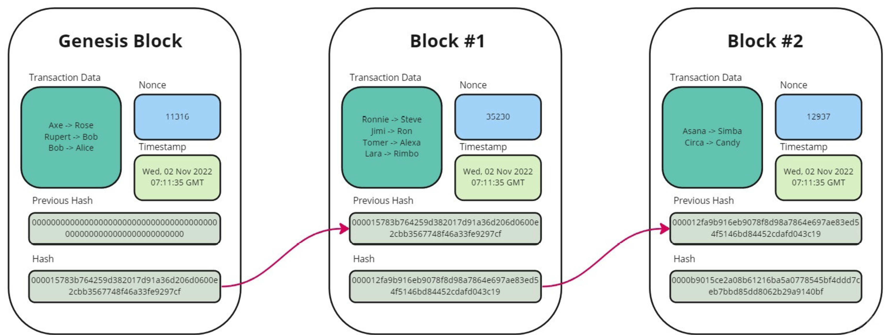

## Why not just database?
- No admin
- Most blockchains are engineered to be permissionless
- Only have insert operations - inherently immutable
  - This implies that blockchains are not recursive in nature: no repeat

## Web3? 
This is quite a confusing term. This essentially means "internet of blockchains."
Until web 2.0, we had client-server architecture applications. 
As the blockchain promises more decentralized internet, now it's called web3.

## Blocks

- Genesis block: The first block that has no previous hash is called genesis block. 
- Hash: each block holds two hashes - previous one and its own. 
- Nonce: this stands for "number only used once." Nonce needs to be consistent with the hash for the block to be valid. If it doesn't, the following blocks go out of sync.

## Hashes
SHA-256 stands as the most popular choice within blockchains due to its robust hash security features and the notable fact that it remains unbroken to this day. 
Four properties of SHA-256:
- One-way: The hash generated from SHA-256 is 256 bits (or 32 bytes) in length and is irreversible - You cannot get plaintext back.
- Deterministic: Every time you send a particular data through the algorithm, you will get the same predictable result. This means that the hash doesn’t change for the same data.
- Avalanche effect: Changing one character of the data, completely changes the hash and makes it unrecognizable.
- Withstand collision: Collision in hashing means the algorithm produces the same hash for two different values. SHA-256 has an extremely low probability of collision

These SHA-256 properties explain why blockchains are the way they are.

## Transactions 
Let's take an example transaction fields from Bitcoin
- Version: This specifies which rules the transaction follows
- Input counter:  This is the number of inputs in the transaction (this is just a count)
- Inputs: This is the actual input data
- Output counter: This is similar to the input counter, but it’s for keeping a count of the transactions’ output
- Output: This is the actual output data from the transaction
- Blocktime: This is simply a Unix timestamp that records when the transaction happened.

Initially, blockchains were designed to record financial transactions. But transactions in the context of blockchains means:
"anything that changes the state of the blockchain"